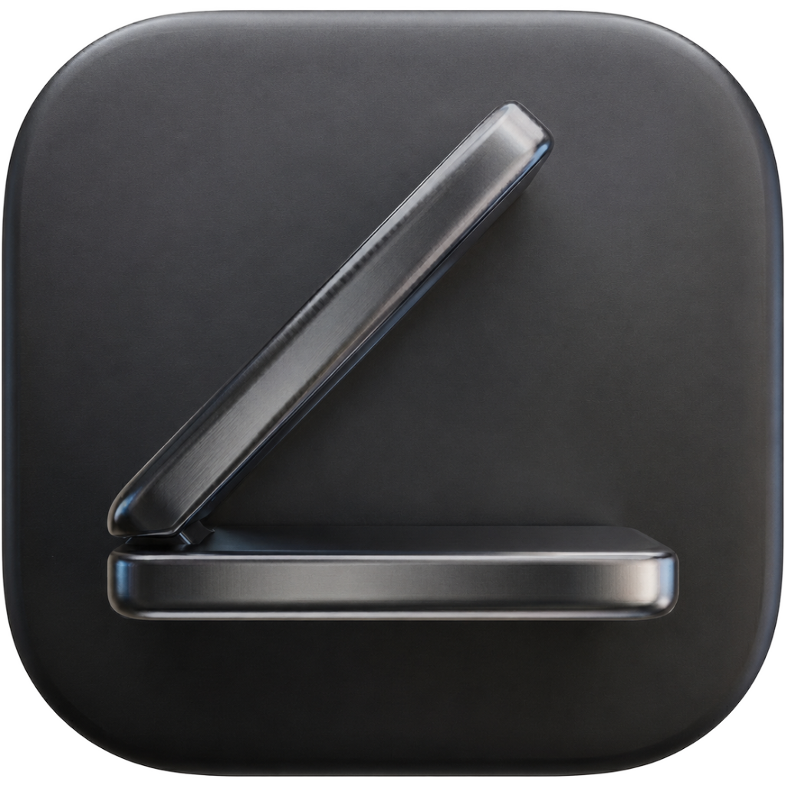

<p align="left">
  <h1 align="left">Awayke</h3>
</p>


**Close your lid. Keep your agents running.**


Earlier this year Business Insider profiled the AI coders [walking around with their MacBook lids cracked open](https://www.businessinsider.com/coders-keep-laptops-open-in-public-ai-agent-2026-5).

Awayke is the fix.


## What it does

Single click in your menubar:

- **Orange laptop icon** - active: lid-close sleep is disabled. Close the lid and your agents keep running.
- **White laptop icon** - inactive: normal macOS sleep behavior restored.

On first launch, macOS asks you to approve Awayke's background helper. Approve it once and every toggle from then on is instant and silent — no password prompts, ever.

Quitting Awayke always re-enables sleep automatically.


## Who it's for

You're running Claude Code, Codex, or Cursor on a long task. You want to close your laptop, walk to the next room, come back. You don't want to come back to a dead session.

If you've ever wedged something in your hinge to fake an external display, this is for you.


## Does it work with the lid fully closed?

**Yes, that's the entire point**

Awayke uses the `pmset disablesleep` mechanism, Apple's own system-level power management command, which operates below the layer that App Store sandbox restrictions apply to. This is what makes it work where other "Keep Awake" apps may fail to execute.


## Is this dangerous?

**The command Awayke uses is Apple's own tooling. And for the use case it's designed for: no.**

MacBooks exhaust heat upward through the keyboard area. When the lid is closed, that exhaust path is partially restricted. Apple's own clamshell mode is officially supported, but only with AC power and an external monitor — partly because a connected display signals "I'm on a desk with ventilation, not in a bag."

The dangerous scenario is: lid closed + inside a bag + heavy GPU/CPU load + conservative 15+ minutes. That's where sustained heat causes long-term degradation.

**Awayke is designed for short hops: walking from one room to another, stepping into a meeting, a bathroom break.** 5–10 minutes, lid closed, ambient air around the laptop. Thermal risk in that scenario is genuinely low. Apple Silicon chips throttle gracefully before anything damaging happens.

The bigger real-world risk is forgetting Awayke is on, putting the laptop in a bag, and coming back to a drained battery and a hot backpack an hour later. That's what a future enhancment protects against (5-minute auto-revert).

**Keep the laptop on AC while Awayke is active.** macOS will still force sleep on critical battery regardless of `disablesleep`.


## How it works

macOS has a separate sleep pathway for lid-close events — independent from the display sleep that most "keep awake" apps target. The only reliable override is `pmset disablesleep`, Apple's own system-level power management command.

Awayke wraps this in a single menubar toggle with no configuration surface.

A privileged SMAppService helper daemon, installed once on first run, executes the `pmset` calls as root over XPC. After the one-time approval, every toggle is instant and silent — including across reboots. If the user declines approval, Awayke falls back to running the command via `osascript` with admin privileges, which prompts for the password on each toggle.


## Install

**Download (recommended):**

1. Download the latest `Awayke.app.zip` from [Releases](https://github.com/daemonphantom/awayke/releases).
2. Unzip, drag to `/Applications`.
3. Open it.

**Build from source:**

```bash
git clone https://github.com/daemonphantom/Awayke.git
cd Awayke
open Awayke.xcodeproj
```

Requires Xcode 16+, macOS 13 Ventura or later.


## Caveats

- `pmset -a disablesleep` is system-wide. While Awayke is active, nothing will sleep from a closed lid.
- macOS will still force sleep on critical battery regardless of `disablesleep`. Keep the laptop on AC.


## Why this exists

Amphetamine is the right idea with the wrong UX. Awayke is the right idea with the right UX.


## License

MIT
